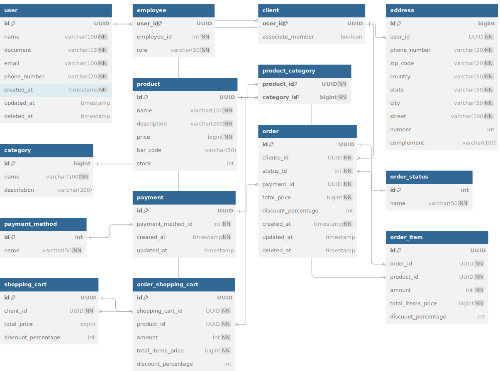

<h2 align="center">Smart Manage: Sistema para Gerenciamento de Vendas</h2>
 

## Sumário
- [Visão geral](#visao-geral)
- [Diagrama de classes](#diagrama-de-classes)
- [Requisitos do produto](#requisitos-do-produto)

 

## Visão geral
Repositório dedicado ao desenvolvimento do trabalho da disciplina Técnicas de Programação em Plataformas Emergentes do 1º semestre de 2025.

Para este trabalho, foi selecionado um projeto previamente desenvolvido na disciplina de Orientação a Objetos, com o objetivo de criar uma nova versão reestruturada, incorporando novas tecnologias e a aplicação de boas práticas de engenharia de software.

O projeto original está disponível neste [repositório](https://gitlab.com/liander/ep1), enquanto a proposta completa de desenvolvimento pode ser consultada [aqui](https://gitlab.com/oofga/eps/eps_2019_2/ep1).

 

## Diagrama de Classes

<figcaption align="center" >Figura 1 - Diagrama de Classes. Fonte: Bruna Lima </figcaption>

 

## Diagrama Físico de Banco de Dados

<figcaption align="center" >Figura 2 - Diagrama Físico. Fonte: Bruna Lima </figcaption>

 

## Requisitos

Para visualizar a lista de requisitos do projeto, acesse o arquivo de [backlog](./docs/backlog.md).