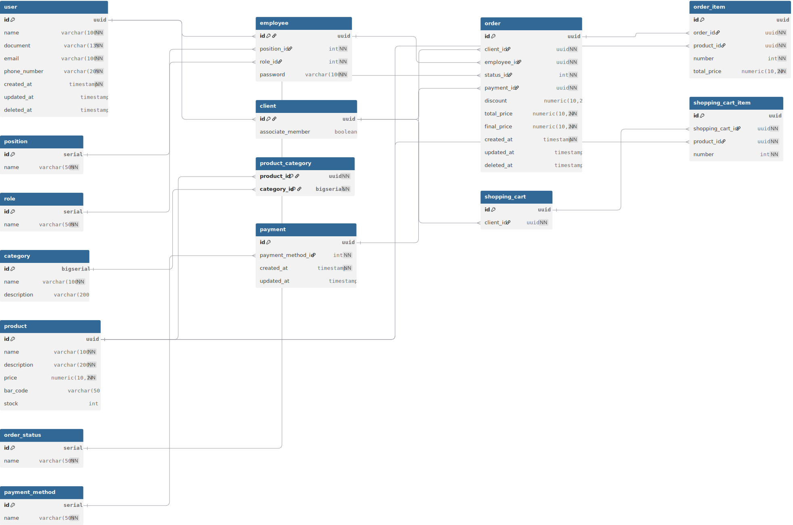

<h2 align="center">Smart Manage: Sistema para Gerenciamento de Vendas</h2>
 

## Sumário
- [Visão geral](#visão-geral)
- [Backlog](#backlog)
- [Diagrama de classes](#diagrama-de-classes)
- [Diagrama físico de banco de dados](#diagrama-físico-de-banco-de-dados)
- [Arquitetura](#arquitetura)
- [Tecnologias](#tecnologias)
- [Protótipo de alta fidelidade](#protótipo-de-alta-fidelidade)

 

## Visão geral

Este documento apresenta as decisões técnicas do projeto, bem como sua organização arquitetural, modelagem de dados e especificações de design.

 

## Backlog

### User role

- **Usuário**: Papel genérico que representa qualquer pessoa autenticada no aplicação. Engloba tanto administradores quanto funcionários.
- **Administrador**: Usuário com permissão para supervisionar todos os aspectos da aplicação.
- **Funcionário**: Usuário responsável por executar as operações diárias do aplicação.

| Feature | User story |
|---------|------------|
| **[FEAT01]** Gerenciamento de usuários | **[US01]** Como usuário, quero ser capaz de me autenticar para acessar as funcionalidades da aplicação de forma segura e personalizada para o meu perfil.   **[US02]** Como administrador, quero ser capaz de cadastrar um funcionário para que ele possa acessar e utilizar o sistema.   **[US03]** Como administrador, quero ser capaz de visualizar o registro de um funcionário para consultar suas informações.   **[US04]** Como funcionário, quero ser capaz de cadastrar um cliente para realizar vendas.   **[US05]** Como funcionário, quero ser capaz de visualizar o registro de um cliente para consultar suas informações. |
| **[FEAT02]** Gerenciamento de estoque | **[US06]** Como funcionário, quero ser capaz de cadastrar uma nova categoria para classificar os produtos. <br'> **[US07]** Como funcionário, quero ser capaz de visualizar todas as categorias para consultar suas informações.   **[US08]** Como funcionário, quero ser capaz de visualizar o registro de uma categoria para consultar suas informações.   **[US09]** Como funcionário, quero ser capaz de cadastrar um produto para adicionar um novo item ao estoque.   **[US10]** Como funcionário, quero ser capaz de visualizar o registro de um produto para consultar suas informações.   **[US11]** Como funcionário, quero ser capaz de visualizar uma lista de todos os produtos e buscar por nome para encontrar rapidamente os itens desejados. |
| **[FEAT03]** Gerenciamento de vendas | **[US12]** Como funcionário, quero ser capaz de adicionar itens ao carrinho de um cliente para preparar o seu pedido.   **[US13]** Como funcionário, quero ser capaz de visualizar o carrinho de um cliente para revisar os itens que foram adicionados.   **[US14]** Como funcionário, quero ser capaz de cadastrar o pedido para registrar a compra de um cliente.   **[US15]** Como funcionário, quero ser capaz de visualizar o histórico de pedidos de um cliente para revisar itens ou acompanhar o status. |

 

## Diagrama de classes

<figcaption align="center"><strong>Figura 1</strong> - Diagrama de Classes. Fonte: Bruna Lima</figcaption>

 

## Diagrama físico de banco de dados

<figcaption align="center" >Figura 2 - Diagrama Físico. Fonte: Bruna Lima </figcaption>

 

## Arquitetura

A API segue uma arquitetura em camadas, com as seguintes divisões:

- **Apresentação**: Responsável por receber requisições HTTP e retornar respostas.
- **Negócio**: Contém a lógica de negócio e regras da aplicação
- **Persistência**: Gerencia o acesso aos dados e operações no banco de dados
- **Dados**: Define as entidades do domínio e mapeamento objeto-relacional

 

## Tecnologias

- Java 21
- Maven 3.11.0
- Spring Boot 3.4.5
- Spring Data JPA
- Spring Security
- SpringDoc OpenAPI
- PostgreSQL 15.3
- Flyway
- Checkstyle (como linter para java)
- JUnit 5
- Mockito
- Docker
- Docker Compose

 

## Protótipo de alta fidelidade

Acesse o protótipo através [deste link](https://www.figma.com/design/fUqeITr8GniPJzMpBXoFZZ/Smart-Manage-v2?node-id=28-146).

 